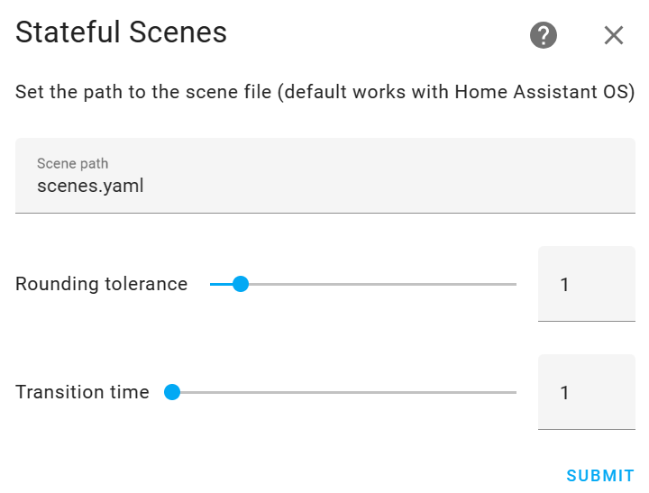

# Stateful Scenes
[](https://github.com/custom-components/hacs)


> Do you want to use your Home Assistant scenes in HomeKit, but get annoyed when the scenes do not stay ‘on’?

Stateful Scenes solves this problem by creating a switch for each scene and inferring the state of the scene by analysing the entities in the scene. Plus, when you activate a scene in Home Assistant, the scene will also turn on in HomeKit—magic!

## Installation
### HACS
Install via [HACS](https://hacs.xyz) by searching for `stateful scenes` in the integrations section, or simply click the button:

[](https://my.home-assistant.io/redirect/hacs_repository/?owner=hugobloem&repository=stateful_scenes&category=integration)

### Manual
Clone the repository and copy the custom_components folder to your home assistant config folder.

```bash
git clone https://github.com/hugobloem/stateful_scenes.git
cp -r stateful_scenes/custom_components config/
```

## Configuration
This integration is now configured via the config flow. After you have installed and restarted Home Assistant, go to Devices and Services, Add Integration, and search for Stateful Scenes. Alternatively, just click this button:

[](https://my.home-assistant.io/redirect/integration/?domain=stateful_scenes)



### Scene path
If your configuration has a different location for scenes you can change the location by changing the `Scene path` variable. By default, Home Assistant places all scenes inside `scenes.yaml` which is where this integration retrieves the scenes.

### Rounding tolerance
Some attributes such as light brightness will be rounded off. Therefore, to assess whether the scene is active a tolerance will be applied. The default tolerance of 1 will work for rounding errors of ±1. If this does not work for your setup consider increasing this value.

### Restore on deactivation
You can set up Stateful Scenes to restore the state of the entities when you want to turn off a scene. This can also be configured per Stateful Scene by going to the device page.  Some complex scenes might not be able to restore the state of all the entities and may benefit from configuring an opposing 'off' scene as described below.

### Transition time
Furthermore, you can specify the default transition time for applying scenes. This will gradually change the lights of a scene to the specified state. Transition time does need to be supported by your lights.

### Debounce time

After activating a scene by turning on a stateful scene switch, entities may need some time to achieve their desired states after the transition time elapses. When first turned on, the scene state switch will be assumed to be 'on'; the debounce time setting controls how long this integration will wait after observing a member entity state update event before reevaluating the entity state to determine if the scene is still active. If you're having issues with scenes immediately deactivating/reactivating, consider increasing this debounce time.

This setting is measured in seconds, but sub-second values (e.g '0.1' for 100ms delay) can be provided such that the delay is not perceptible to humans viewing a dashboard, for example.

### Supported attributes
Note that while all entity states are supported only some entity attributes are supported at the moment. For the entities listed in the table the state is supported as well as the attributes in the table. Please open an issue, if you want support for other entity attributes.

| Entity Domain  | Attributes                               |
|----------------|------------------------------------------|
| `light`        | `brightness`, `rgb_color`, `effect`      |
| `cover`        | `position`                               |
| `media_player` | `volume_level`, `source`                 |
| `fan`          | `direction`, `oscillating`, `percentage` |


## Scene configurations
For each scene you can specify:

- The debounce time which is applied after the transition time has elapsed
- Whether to ignore stateful scene changes when the underlying scene is unavailable
- Specify an opposing 'off' scene that is activated when the stateful scene is deactivated
    (when Restore is off)
- Restore the previous state on deactivation by changing the variables on the scene's device page.
- The scene tolerance for the stateful scene to be active
- The individual transition time

## External Scenes
> Note this is an EXPERIMENTAL feature and may not work correctly for your setup. I have tested it with scenes configured in Zigbee2MQTT which works, but I do not have access to a Hue hub which therefore may not work correctly. If you are experiencing issues, please let me know or open a pull request with the improvements. 

For scenes defined within Home Assistant the configurations are available in `scenes.yaml` however for scenes defined outside of Home Assistant such as within Zigbee2MQTT or another Zigbee hub these configuration files are not available. Therefore, Stateful Scenes can now learn the configuration of these external scenes by activating them and storing the parameters for each entity.

To set this up, configure Stateful Scenes as normal. Then, any external scenes should be discovered or can be added manually by adding an entry on the integration page. The UI will then ask you what entities are controlled by the scene followed by activating the scene and saving the entity states. 

As mentioned before this is an experimental feature. There are many different configurations out there and some hardware may behave differently than others. This may cause issues in setting up this feature. 

## HomeKit configuration
Once you have configured this integration, you can add the scenes to HomeKit. I assume that you already set up and configured the HomeKit integration. Expose the newly added switches to HomeKit. Then, in HomeKit define scenes for each Stateful Scenes switch.
